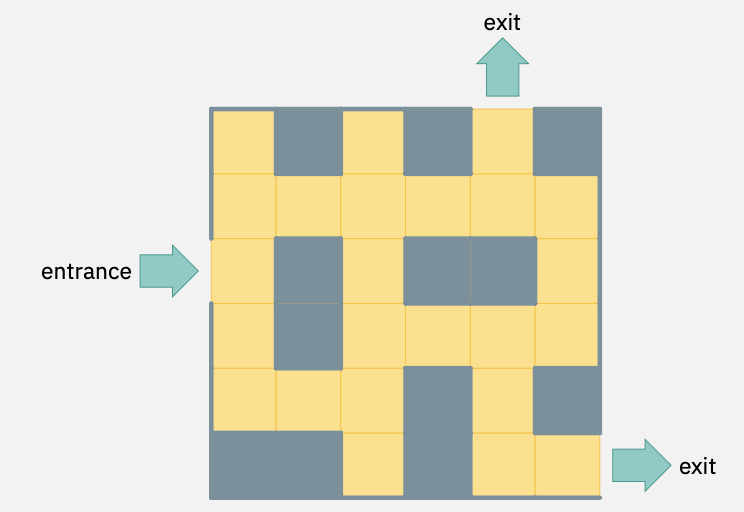

# MazeACO
Using Ant Colony Optimisation algorithm to solve the shortest path to exits problem in a maze.

## Running the algorithm
Put all .py files in the same directory, and run main.py using a Python IDE.
It is recommended to run this algorithm on Python IDEs that supports the integration of matplotlib such as Spyder.

## Problem Description
In this problem, we are required to find the shortest path for the player to go from one entrance to one of the exits, in a maze by applying the Ant Colony Optimization (ACO) algorithm. In other words, we are trying to solve the shortest path problem with the ACO algorithm. However, the solution found should always lead to the nearest exit because the path to the further exit would not be considered the shortest path if it takes a longer path to reach it than the nearest exit. The shortest-path problem involves finding paths with shortest lengths between selected pairs of vertices. In this case, the vertices are represented by each space of the maze. There may be multiple routes between the source (entrance) and destination (goal). Therefore, by using short path algorithms such as the Ant Colony Optimization (ACO) algorithm, we would be able to identify one path that is the shortest path that leads to one of the exits from the entrance.

## Problem Formulation
To formulate this problem, a maze with some blocked paths of the size of 6x6 is initialised.

For better clarity, I’ve separated the codes into four files, namely main.py, p1functions.py, node.py, and ant.py which has the main codes with problem formulation, codes of functions, Node class codes, and Ant class codes in the four files respectively.

## Built On/With
Built On : Python
Built With : Spyder
